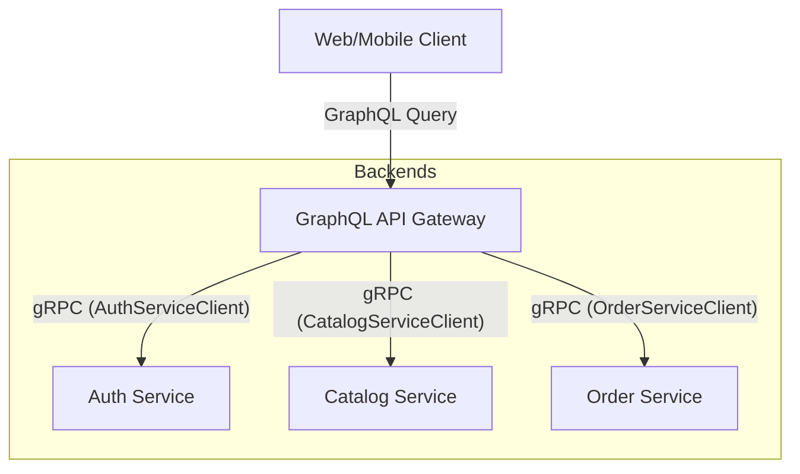

# GraphQL Gateway with gRPC Backend Microservices

In an e-commerce microservices architecture, client applications (Web, Mobile) often communicate with a single entry point—the **API Gateway** (or **BFF: Backend-for-Frontend**). When using GraphQL at the gateway level and gRPC/Protobuf for internal microservices, you face a common architectural question: **Do we have to define separate GraphQL schemas, or can we automate the translation?**

Here is a breakdown of how the gateway works under both approaches, their toolsets, and recommendations.

---

## 1. Gateway Architecture

The GraphQL Gateway acts as a translation layer. It accepts GraphQL queries, parses them, resolves fields by invoking internal gRPC services using compiled protobuf clients, and aggregates the results into a single JSON response.



---

## 2. Approach 1: Separate GraphQL Schema & Manual Mapping (Recommended)

In this approach, you write a distinct GraphQL schema (`schema.graphql`) tailored to the frontend's needs. You then implement Go resolvers that call the gRPC client methods generated from your `.proto` files.

### Workflow
1. Write `.proto` files for backend microservices.
2. Compile proto files into Go structs (`*.pb.go` and `*_grpc.pb.go`).
3. Write `schema.graphql` for the Gateway.
4. Use a Go tool like **gqlgen** to generate GraphQL types and resolver interfaces.
5. In the generated resolver methods, call the gRPC service.

### Example (Order Detail Query)
**GraphQL Schema (`schema.graphql`)**:
```graphql
type Query {
  order(id: ID!): Order
}

type Order {
  id: ID!
  user: User!
  items: [OrderItem!]!
  totalAmountCents: Int!
  status: OrderStatus!
}

type User {
  id: ID!
  email: String!
  name: String!
}

type OrderItem {
  productId: ID!
  quantity: Int!
  priceCents: Int!
}

enum OrderStatus {
  PENDING
  COMPLETED
  FAILED
  CANCELLED
}
```

**Go Resolver Code (Using `gqlgen`)**:
```go
package graph

import (
	"context"
	
	"github.com/yourusername/ecommercesagapattern/apigateway/graph/model"
	"github.com/yourusername/ecommercesagapattern/shared/pb/accountv1"
	"github.com/yourusername/ecommercesagapattern/shared/pb/orderv1"
)

type Resolver struct {
	OrderClient   orderv1.OrderServiceClient
	AccountClient accountv1.AccountServiceClient
}

func (r *queryResolver) Order(ctx context.Context, id string) (*model.Order, error) {
	// 1. Fetch order from gRPC Order Service
	orderProto, err := r.OrderClient.GetOrder(ctx, &orderv1.GetOrderRequest{OrderId: id})
	if err != nil {
		return nil, err
	}

	// 2. Fetch associated user profile from gRPC Account Service
	userProto, err := r.AccountClient.GetProfile(ctx, &accountv1.GetProfileRequest{UserId: orderProto.UserId})
	if err != nil {
		return nil, err
	}

	// 3. Map Protobuf structs to GraphQL model structs
	return &model.Order{
		ID:               orderProto.OrderId,
		TotalAmountCents: int(orderProto.TotalAmountCents),
		Status:           model.OrderStatus(orderProto.Status.String()),
		User: &model.User{
			ID:    userProto.UserId,
			Email: userProto.Email,
			Name:  userProto.Name,
		},
		Items: mapOrderItems(orderProto.Items),
	}, nil
}
```

### Pros & Cons
* **Pros**: 
  * **Optimized for Clients**: GraphQL schemas are designed for UI rendering. They do not have to match internal gRPC structures exactly.
  * **Decoupling**: You can modify backend gRPC fields without immediately breaking the frontend client APIs.
  * **Data Aggregation (N+1 resolution)**: Resolvers can stitch together multiple internal gRPC calls (e.g., merging Order and Account data as shown above).
* **Cons**:
  * Write schemas twice (Protobuf and GraphQL).
  * Write manual mapping boilerplate code.

---

## 3. Approach 2: Automatic Schema Generation (Protobuf $\rightarrow$ GraphQL)

If you want to avoid writing a separate schema and resolvers, you can use automated compilers that generate the GraphQL schema and sometimes even a proxy server directly from the protobuf files.

### Tools available
1. **`protoc-gen-graphql`**:
   * A plugin for `protoc`. It reads your `.proto` files and automatically produces GraphQL schemas (`.graphql`) or TypeScript/Go resolver stubs.
2. **Rejoiner (by Google)**:
   * Generates a GraphQL schema from gRPC microservices by inspecting gRPC reflection data or metadata at runtime.
3. **API Gateway Proxies (e.g., WunderGraph, Gloo, Envoy)**:
   * They configure their internal proxy engines to expose a GraphQL interface by mapping schema fields directly to backend gRPC services.

### Pros & Cons
* **Pros**:
  * **Zero Boilerplate**: No need to write schemas twice.
  * **Speed**: Fast setup; instantly exposes new backend services to the frontend.
* **Cons**:
  * **Leaky Abstraction**: Exposes backend implementation details directly to the client. Protobuf design paradigms (RPC style, flat request/response structures) are very different from GraphQL paradigms (nested query graphs).
  * **Inflexibility**: Custom schema tailoring, client-specific optimizations, and aggregation (stitching multiple microservice responses into a single nested object) are very difficult to implement.

---

## 4. Architectural Summary

| Metric | Manual Mapping (Recommended) | Auto-Generation (Proxy/CodeGen) |
|---|---|---|
| **Development Speed** | Medium (requires initial mapping) | High (instant translation) |
| **API Quality** | Excellent (designed for UI requirements) | Poor (exposes RPC structures directly) |
| **Decoupling** | High (backend and frontend can evolve independently) | Low (changes in proto instantly change GraphQL schema) |
| **Aggregation Capabilities** | Excellent (natural in Go resolvers) | Limited (usually requires custom proxy scripts) |

---

## Recommendation for this Project

For a production-grade e-commerce microservice system using the Saga Pattern, **Approach 1 (Separate GraphQL Schema with Go resolver mapping using `gqlgen`)** is highly recommended. 

Because e-commerce UIs require rich nested structures (e.g., showing user profiles, active orders, product inventory states, and payment statuses on a single dashboard), the gateway needs to aggregate data from multiple services. Doing this manually via Go resolvers gives you complete control over authentication, rate limiting, and performance optimization (such as using data-loaders to batch gRPC calls).
▸ Thought Process
  Discovering Relevant Files
  Congratulations! The GraphQL Gateway has been successfully bootstrapped.

  Here is the list of files that were generated inside the apigateway directory, along with a detailed explanation of their
  significance and how we will use them.
  ──────
  ### 📂 Directory & File Breakdown
    apigateway/
    ├── go.mod & go.sum
    ├── gqlgen.yml                # Configuration file
    ├── server.go                 # Application Entry Point
    └── graph/
        ├── schema.graphqls       # GraphQL Schema
        ├── generated.go          # GraphQL Execution Engine (DO NOT EDIT)
        ├── model/
        │   └── models_gen.go     # Automatically generated Go structs
        ├── resolver.go           # Dependency Injection Hub
        └── schema.resolvers.go   # Business Logic / gRPC calls
    ──────
  ### 1. gqlgen.yml (Configuration File)

  • What it is: The configuration settings file that tells the gqlgen compiler how to translate your GraphQL schema into Go code.
  • Why it matters: It configures where the output files should be generated, how to name packages, and how GraphQL types map to Go
  types.
  • How we will use it: We will modify this file later to map custom types (like binding the GraphQL Product type to use a custom Go
  struct rather than auto-generating one, or binding dates to Go's standard time.Time).

  ### 2. server.go (The Gateway Web Server)

  • What it is: The main entrypoint of your API Gateway. It sets up an HTTP server, defines the routes, mounts the GraphQL Playground
  (a browser sandbox to test queries), and exposes the GraphQL API endpoint.
  • Why it matters: It is the bootstrap script for the whole gateway binary.
  • How we will use it: The default file uses Go's standard library http.ListenAndServe. In production, we need a robust HTTP router.
  We will refactor this to use Chi router and inject:
      • JWT Authentication middleware (to intercept incoming HTTP headers and validate tokens via the Auth Service).
      • gRPC connection pools (creating connections to Auth, Catalog, and Order microservices).
      • OpenTelemetry/Jaeger middleware for distributed tracing.


  ### 3. graph/schema.graphqls (The GraphQL Contract)

  • What it is: The GraphQL Schema Definition Language (SDL) file where you define what queries, mutations, and types the clients can
  access.
  • Why it matters: This file is the single source of truth for the API contract between frontends and your backend.
  • How we will use it: We have already put our schema here. If we need to add new features (e.g., adding user shopping carts), we
  modify this file first, then run go run github.com/99designs/gqlgen generate to sync our Go codebase.

  ### 4. graph/generated.go (The GraphQL Engine)

  • What it is: A massive file containing the internal type-safety check, JSON parsing, query complexity analysis, and query execution
  mapping.
  • ⚠️ Crucial Rule: DO NOT EDIT THIS FILE. It is completely managed by gqlgen. If you change it, your changes will be deleted the next
  time you generate code.
  • How we will use it: We leave it completely alone. It works automatically in the background.

  ### 5. graph/model/models_gen.go (GraphQL Go Structs)

  • What it is: Contains the Go struct definitions corresponding to your GraphQL types (like type User struct or type Order struct).
  • Why it matters: In Go, we need statically-typed structs to handle data. gqlgen generates these based on schema.graphqls.
  • How we will use it: When our resolvers fetch data from microservices, they will map the gRPC protobuf data into these generated
  structs before returning them to gqlgen.

  ### 6. graph/resolver.go (Dependency Hub)

  • What it is: A Go file containing a simple empty struct: type Resolver struct{}.
  • Why it matters: This file will not be overwritten when you run the generate command. It is where you inject dependencies that your
  API endpoints need.
  • How we will use it: This is where we inject our gRPC client connections. We will modify it to hold gRPC clients:
    type Resolver struct {
        AuthClient    authv1.AuthServiceClient
        CatalogClient catalogv1.CatalogServiceClient
        OrderClient   orderv1.OrderServiceClient
    }
    Since all resolver files reference this parent struct, every GraphQL query resolver will automatically have access to these gRPC
  connections!

  ### 7. graph/schema.resolvers.go (The Heart of the Gateway)

  • What it is: The actual Go files where you write the code to resolve queries and mutations (e.g., what happens when someone calls
  query { me { name } }).
  • Why it matters: This is the translation layer. It sits between the client request and your backend microservices.
  • How we will use it: We will write the Go code that extracts the client request parameters, invokes the corresponding gRPC client
  (stored in Resolver), maps the gRPC response into GraphQL model structs, and returns it.
  • Note: gqlgen is smart. If you run generate, it will create empty template functions for new schema fields, but it will keep and
  protect any custom Go code you already wrote inside existing resolver functions.
  ──────
  ### 🔄 The End-to-End Request Lifecycle

  To see how they coordinate, here is how a client request flows through these files:

    sequenceDiagram
        actor Client
        participant Server as server.go (HTTP Server)
        participant Engine as graph/generated.go (GraphQL Engine)
        participant Resolvers as graph/schema.resolvers.go (Your Go Code)
        participant DepHub as graph/resolver.go (gRPC Client Store)
        participant Backends as gRPC Microservices

        Client->>Server: HTTP POST /query { me { name } }
        Server->>Engine: Validate Query against schema.graphqls
        Note over Engine: Query is valid!
        Engine->>Resolvers: Invoke Me() function
        Resolvers->>DepHub: Read Account gRPC Client
        DepHub->>Backends: GetProfile(ctx, userID) (gRPC Call)
        Backends-->>DepHub: Returns Protobuf Message
        DepHub-->>Resolvers: Returns Protobuf Message
        Note over Resolvers: Map Protobuf properties to model.User struct
        Resolvers-->>Engine: Returns *model.User
        Engine-->>Server: Serializes User to JSON response
        Server-->>Client: HTTP 200 { "data": { "me": { "name": "Jane" } } }
    ──────
  ### 🚀 What is the Next Action?

  Now that we understand the structure, the next step is to configure graph/resolver.go to support gRPC connections, and refactor
  server.go to mount a proper HTTP router (Chi) and prepare for the gRPC clients.

  Would you like me to walk you through how to configure graph/resolver.go first?