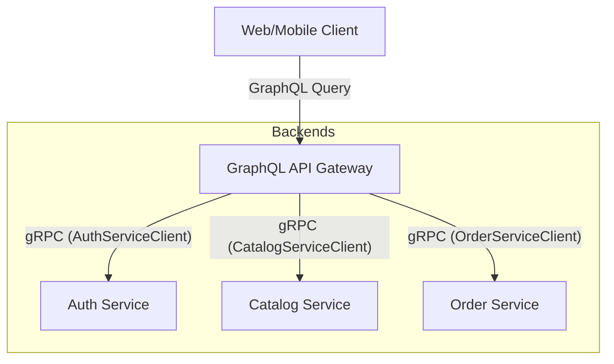

# GraphQL Gateway with gRPC Backend Microservices

In an e-commerce microservices architecture, client applications (Web, Mobile) often communicate with a single entry point—the **API Gateway** (or **BFF: Backend-for-Frontend**). When using GraphQL at the gateway level and gRPC/Protobuf for internal microservices, you face a common architectural question: **Do we have to define separate GraphQL schemas, or can we automate the translation?**

Here is a breakdown of how the gateway works under both approaches, their toolsets, and recommendations.

---

## 1. Gateway Architecture

The GraphQL Gateway acts as a translation layer. It accepts GraphQL queries, parses them, resolves fields by invoking internal gRPC services using compiled protobuf clients, and aggregates the results into a single JSON response.



---

## 2. Approach 1: Separate GraphQL Schema & Manual Mapping (Recommended)

In this approach, you write a distinct GraphQL schema (`schema.graphql`) tailored to the frontend's needs. You then implement Go resolvers that call the gRPC client methods generated from your `.proto` files.

### Workflow
1. Write `.proto` files for backend microservices.
2. Compile proto files into Go structs (`*.pb.go` and `*_grpc.pb.go`).
3. Write `schema.graphql` for the Gateway.
4. Use a Go tool like **gqlgen** to generate GraphQL types and resolver interfaces.
5. In the generated resolver methods, call the gRPC service.

### Example (Order Detail Query)
**GraphQL Schema (`schema.graphql`)**:
```graphql
type Query {
  order(id: ID!): Order
}

type Order {
  id: ID!
  user: User!
  items: [OrderItem!]!
  totalAmountCents: Int!
  status: OrderStatus!
}

type User {
  id: ID!
  email: String!
  name: String!
}

type OrderItem {
  productId: ID!
  quantity: Int!
  priceCents: Int!
}

enum OrderStatus {
  PENDING
  COMPLETED
  FAILED
  CANCELLED
}
```

**Go Resolver Code (Using `gqlgen`)**:
```go
package graph

import (
	"context"
	
	"github.com/yourusername/ecommercesagapattern/apigateway/graph/model"
	"github.com/yourusername/ecommercesagapattern/shared/pb/accountv1"
	"github.com/yourusername/ecommercesagapattern/shared/pb/orderv1"
)

type Resolver struct {
	OrderClient   orderv1.OrderServiceClient
	AccountClient accountv1.AccountServiceClient
}

func (r *queryResolver) Order(ctx context.Context, id string) (*model.Order, error) {
	// 1. Fetch order from gRPC Order Service
	orderProto, err := r.OrderClient.GetOrder(ctx, &orderv1.GetOrderRequest{OrderId: id})
	if err != nil {
		return nil, err
	}

	// 2. Fetch associated user profile from gRPC Account Service
	userProto, err := r.AccountClient.GetProfile(ctx, &accountv1.GetProfileRequest{UserId: orderProto.UserId})
	if err != nil {
		return nil, err
	}

	// 3. Map Protobuf structs to GraphQL model structs
	return &model.Order{
		ID:               orderProto.OrderId,
		TotalAmountCents: int(orderProto.TotalAmountCents),
		Status:           model.OrderStatus(orderProto.Status.String()),
		User: &model.User{
			ID:    userProto.UserId,
			Email: userProto.Email,
			Name:  userProto.Name,
		},
		Items: mapOrderItems(orderProto.Items),
	}, nil
}
```

### Pros & Cons
* **Pros**: 
  * **Optimized for Clients**: GraphQL schemas are designed for UI rendering. They do not have to match internal gRPC structures exactly.
  * **Decoupling**: You can modify backend gRPC fields without immediately breaking the frontend client APIs.
  * **Data Aggregation (N+1 resolution)**: Resolvers can stitch together multiple internal gRPC calls (e.g., merging Order and Account data as shown above).
* **Cons**:
  * Write schemas twice (Protobuf and GraphQL).
  * Write manual mapping boilerplate code.

---

## 3. Approach 2: Automatic Schema Generation (Protobuf $\rightarrow$ GraphQL)

If you want to avoid writing a separate schema and resolvers, you can use automated compilers that generate the GraphQL schema and sometimes even a proxy server directly from the protobuf files.

### Tools available
1. **`protoc-gen-graphql`**:
   * A plugin for `protoc`. It reads your `.proto` files and automatically produces GraphQL schemas (`.graphql`) or TypeScript/Go resolver stubs.
2. **Rejoiner (by Google)**:
   * Generates a GraphQL schema from gRPC microservices by inspecting gRPC reflection data or metadata at runtime.
3. **API Gateway Proxies (e.g., WunderGraph, Gloo, Envoy)**:
   * They configure their internal proxy engines to expose a GraphQL interface by mapping schema fields directly to backend gRPC services.

### Pros & Cons
* **Pros**:
  * **Zero Boilerplate**: No need to write schemas twice.
  * **Speed**: Fast setup; instantly exposes new backend services to the frontend.
* **Cons**:
  * **Leaky Abstraction**: Exposes backend implementation details directly to the client. Protobuf design paradigms (RPC style, flat request/response structures) are very different from GraphQL paradigms (nested query graphs).
  * **Inflexibility**: Custom schema tailoring, client-specific optimizations, and aggregation (stitching multiple microservice responses into a single nested object) are very difficult to implement.

---

## 4. Architectural Summary

| Metric | Manual Mapping (Recommended) | Auto-Generation (Proxy/CodeGen) |
|---|---|---|
| **Development Speed** | Medium (requires initial mapping) | High (instant translation) |
| **API Quality** | Excellent (designed for UI requirements) | Poor (exposes RPC structures directly) |
| **Decoupling** | High (backend and frontend can evolve independently) | Low (changes in proto instantly change GraphQL schema) |
| **Aggregation Capabilities** | Excellent (natural in Go resolvers) | Limited (usually requires custom proxy scripts) |

---

## Recommendation for this Project

For a production-grade e-commerce microservice system using the Saga Pattern, **Approach 1 (Separate GraphQL Schema with Go resolver mapping using `gqlgen`)** is highly recommended. 

Because e-commerce UIs require rich nested structures (e.g., showing user profiles, active orders, product inventory states, and payment statuses on a single dashboard), the gateway needs to aggregate data from multiple services. Doing this manually via Go resolvers gives you complete control over authentication, rate limiting, and performance optimization (such as using data-loaders to batch gRPC calls).
