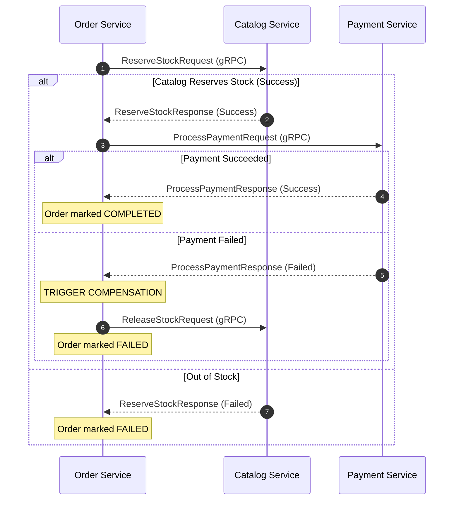

# Inter-Service Communication via gRPC in Go

In our e-commerce microservice system, services communicate internally using **gRPC** (over HTTP/2). Since we are implementing an **Orchestration-Based Saga**, the **Order Service** acts as the central coordinator. 

This document explains how this communication is implemented in Go, providing concrete code examples for:
1. A **gRPC Server** (e.g., the **Catalog Service** listening for stock reservations).
2. A **gRPC Client** (e.g., the **Order Service** connecting to the Catalog Service to initiate a reservation and handle failures/compensations).

---

## 1. Interaction Flow

When a user places an order:
1. The **API Gateway** sends a GraphQL mutation to the **Order Service**.
2. The **Order Service** registers the order in a `PENDING` state and initializes the Saga transaction.
3. The **Order Service** (acting as the client) initiates gRPC requests to the **Catalog Service** and the **Payment Service** (acting as servers).



---

## 2. Server Implementation (Catalog Service)

The **Catalog Service** runs a gRPC server. It registers the generated `CatalogServiceServer` interface and implements the reservation methods.

```go
package main

import (
	"context"
	"log"
	"net"

	"google.golang.org/grpc"
	"google.golang.org/grpc/codes"
	"google.golang.org/grpc/status"

	// Import the generated protobuf package
	"github.com/yourusername/ecommercesagapattern/shared/pb/catalogv1"
)

// catalogServer implements the generated CatalogServiceServer interface
type catalogServer struct {
	catalogv1.UnimplementedCatalogServiceServer
}

func (s *catalogServer) ReserveStock(ctx context.Context, req *catalogv1.ReserveStockRequest) (*catalogv1.ReserveStockResponse, error) {
	log.Printf("Received stock reservation request for order: %s", req.OrderId)

	for _, item := range req.Items {
		log.Printf("Reserving item: %s, Quantity: %d", item.ProductId, item.Quantity)
		
		// TODO: Query database, verify and decrement stock.
		// If stock is insufficient, return a clean business error response:
		// return &catalogv1.ReserveStockResponse{Success: false, Message: "Insufficient stock"}, nil
	}

	// Success response
	return &catalogv1.ReserveStockResponse{
		Success: true,
		Message: "Stock successfully reserved",
	}, nil
}

func (s *catalogServer) ReleaseStock(ctx context.Context, req *catalogv1.ReleaseStockRequest) (*catalogv1.ReleaseStockResponse, error) {
	log.Printf("Received stock release (compensation) request for order: %s", req.OrderId)
	
	// TODO: Increment database stock back to its original state.

	return &catalogv1.ReleaseStockResponse{
		Success: true,
	}, nil
}

func main() {
	lis, err := net.Listen("tcp", ":50051") // Listen on port 50051
	if err != nil {
		log.Fatalf("failed to listen: %v", err)
	}

	grpcServer := grpc.NewServer()
	catalogv1.RegisterCatalogServiceServer(grpcServer, &catalogServer{})

	log.Printf("Catalog gRPC Server listening on :50051")
	if err := grpcServer.Serve(lis); err != nil {
		log.Fatalf("failed to serve: %v", err)
	}
}
```

---

## 3. Client & Saga Orchestration Implementation (Order Service)

The **Order Service** dials the Catalog and Payment services. Below is a Go snippet showing how the Order service uses gRPC clients to run the Saga transaction.

```go
package main

import (
	"context"
	"log"
	"time"

	"google.golang.org/grpc"
	"google.golang.org/grpc/credentials/insecure"

	"github.com/yourusername/ecommercesagapattern/shared/pb/catalogv1"
	"github.com/yourusername/ecommercesagapattern/shared/pb/paymentv1"
)

type SagaOrchestrator struct {
	catalogClient catalogv1.CatalogServiceClient
	paymentClient paymentv1.PaymentServiceClient
}

// ExecuteSaga coordinates the distributed transaction across services
func (o *SagaOrchestrator) ExecuteSaga(ctx context.Context, orderID string, items []*catalogv1.ReserveItem, amount int64) bool {
	// Define a timeout for our internal network calls (e.g., 5 seconds)
	grpcCtx, cancel := context.WithTimeout(ctx, 5*time.Second)
	defer cancel()

	// STEP 1: Reserve Stock
	log.Printf("[SAGA] Step 1: Reserving stock for order %s", orderID)
	reserveResp, err := o.catalogClient.ReserveStock(grpcCtx, &catalogv1.ReserveStockRequest{
		OrderId: orderID,
		Items:   items,
	})
	if err != nil || !reserveResp.Success {
		log.Printf("[SAGA] Step 1 Failed: %v, message: %s. Order aborted.", err, reserveResp.GetMessage())
		return false
	}

	// STEP 2: Process Payment
	log.Printf("[SAGA] Step 2: Processing payment of %d cents", amount)
	paymentResp, err := o.paymentClient.ProcessPayment(grpcCtx, &paymentv1.ProcessPaymentRequest{
		OrderId:            orderID,
		AmountCents:        amount,
		PaymentMethodToken: "mocked_payment_token",
	})

	if err != nil || !paymentResp.Success {
		log.Printf("[SAGA] Step 2 Failed: %v. Initiating Compensation Steps...", err)
		
		// STEP 3 (Compensation): Release Stock
		o.triggerCompensation(ctx, orderID, items)
		return false
	}

	log.Printf("[SAGA] Success: Order %s transaction complete.", orderID)
	return true
}

func (o *SagaOrchestrator) triggerCompensation(ctx context.Context, orderID string, items []*catalogv1.ReserveItem) {
	// Compensations should run with a separate context to ensure they execute even if parent request context is cancelled
	compCtx, cancel := context.WithTimeout(context.Background(), 10*time.Second)
	defer cancel()

	log.Printf("[COMPENSATION] Releasing reserved stock for order %s", orderID)
	_, err := o.catalogClient.ReleaseStock(compCtx, &catalogv1.ReleaseStockRequest{
		OrderId: orderID,
		Items:   items,
	})
	if err != nil {
		// Crucial: In production, failed compensations should trigger alerts or retries to avoid data inconsistency.
		log.Printf("[CRITICAL ERROR] Compensation failed: %v. Manual intervention required.", err)
	}
}

func main() {
	// Establish gRPC connection to Catalog Service (port 50051)
	catalogConn, err := grpc.NewClient("localhost:50051", grpc.WithTransportCredentials(insecure.NewCredentials()))
	if err != nil {
		log.Fatalf("did not connect to Catalog Service: %v", err)
	}
	defer catalogConn.Close()

	// Establish gRPC connection to Payment Service (port 50052)
	paymentConn, err := grpc.NewClient("localhost:50052", grpc.WithTransportCredentials(insecure.NewCredentials()))
	if err != nil {
		log.Fatalf("did not connect to Payment Service: %v", err)
	}
	defer paymentConn.Close()

	// Instantiate gRPC client stubs
	orchestrator := &SagaOrchestrator{
		catalogClient: catalogv1.NewCatalogServiceClient(catalogConn),
		paymentClient: paymentv1.NewPaymentServiceClient(paymentConn),
	}

	// Mock transaction data
	mockItems := []*catalogv1.ReserveItem{
		{ProductId: "prod_iphone15", Quantity: 1},
	}

	success := orchestrator.ExecuteSaga(context.Background(), "order_998877", mockItems, 99900)
	log.Printf("Saga execution success: %t", success)
}
```

---

## 4. Key Takeaways for gRPC Communication

1. **Client Reusability**: Do not create a new gRPC connection (`grpc.NewClient`) for every HTTP request. Establish the connections once when starting up your service, and inject the Client structs into your dependency tree (e.g. into your controllers or Saga handler).
2. **Timeouts (`context.WithTimeout`)**: Always wrap network contexts in a timeout. If a downstream microservice is lagging, you do not want to block your API gateway or client thread indefinitely.
3. **Compensation Context**: When executing compensation code, use a clean background context (`context.Background()`) instead of the request-scope context. If the user cancels their HTTP request mid-transaction, you still want your rollback database statements to run successfully.
4. **Idempotency**: In `triggerCompensation`, the target server must support idempotency. If the `ReleaseStock` command is called multiple times due to retries, the server should ignore subsequent duplicates.
