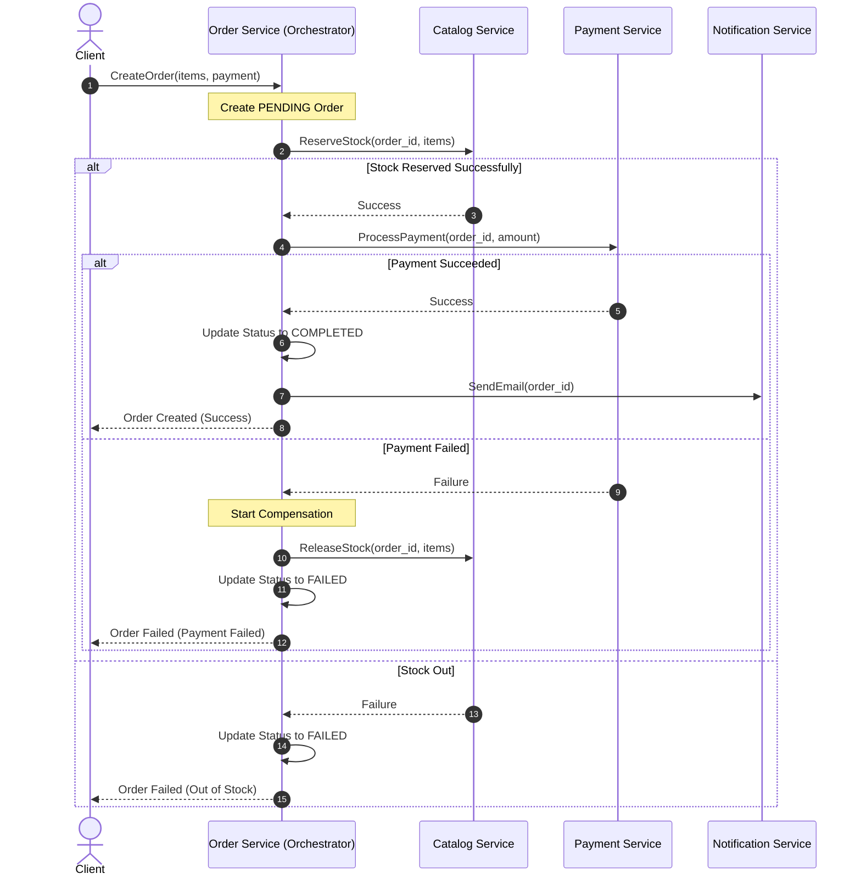

# E-Commerce Microservices Protobuf Schema & Architecture Design

This document details the schema designs for the protocol buffers (Protobuf) used in our Go-based e-commerce microservices, along with recommendations for implementing the **Saga Pattern** for distributed transactions.

---

## 1. Saga Pattern Architecture: Choreography vs. Orchestration

Before finalizing the schemas, we need to decide on the flow of our Saga pattern. In a Go microservice system, there are two primary ways to coordinate the distributed transaction (e.g., Create Order $\rightarrow$ Reserve Inventory $\rightarrow$ Process Payment $\rightarrow$ Confirm Order):

### Option A: Orchestration-Based Saga (Recommended)
A centralized **Saga Orchestrator** (typically embedded inside the **Order Service** or managed via a workflow engine like **Temporal**) coordinates all transactions. It calls the services synchronously (via gRPC) or asynchronously (via commands on a message broker) and decides when to execute success steps or trigger compensation steps.



### Option B: Choreography-Based Saga
There is no central coordinator. Each service reacts to events published on a message broker (e.g., RabbitMQ, Kafka) and publishes its own events.
* **Pros**: Simple to set up initially; loose temporal coupling.
* **Cons**: Can quickly become difficult to reason about as services grow; cyclic dependencies can arise; debugging is harder.

---

## 2. Protobuf Schemas

To ensure cross-service type safety, we store all `.proto` files in a shared folder structure:
`shared/protofiles/<service>/v1/<service>.proto`

### Auth Service (`auth.proto`)
Handles signups, logins, and API Gateway token validation.

```protobuf
syntax = "proto3";

package ecommerce.auth.v1;

option go_package = "github.com/yourusername/ecommercesagapattern/shared/pb/authv1;authv1";

service AuthService {
  rpc Register(RegisterRequest) returns (RegisterResponse);
  rpc Login(LoginRequest) returns (LoginResponse);
  rpc ValidateToken(ValidateTokenRequest) returns (ValidateTokenResponse);
}

message RegisterRequest {
  string email = 1;
  string password = 2;
  string name = 3;
}

message RegisterResponse {
  string user_id = 1;
}

message LoginRequest {
  string email = 1;
  string password = 2;
}

message LoginResponse {
  string token = 1;
  string user_id = 2;
}

message ValidateTokenRequest {
  string token = 1;
}

message ValidateTokenResponse {
  bool is_valid = 1;
  string user_id = 2;
  string role = 3;
}
```

### Account Service (`account.proto`)
Manages user profiles and delivery address settings.

```protobuf
syntax = "proto3";

package ecommerce.account.v1;

option go_package = "github.com/yourusername/ecommercesagapattern/shared/pb/accountv1;accountv1";

import "google/protobuf/timestamp.proto";

service AccountService {
  rpc GetProfile(GetProfileRequest) returns (GetProfileResponse);
  rpc UpdateProfile(UpdateProfileRequest) returns (UpdateProfileResponse);
}

message Address {
  string street = 1;
  string city = 2;
  string state = 3;
  string country = 4;
  string zip_code = 5;
}

message GetProfileRequest {
  string user_id = 1;
}

message GetProfileResponse {
  string user_id = 1;
  string email = 2;
  string name = 3;
  string phone = 4;
  Address address = 5;
  google.protobuf.Timestamp created_at = 6;
}

message UpdateProfileRequest {
  string user_id = 1;
  string name = 2;
  string phone = 3;
  Address address = 4;
}

message UpdateProfileResponse {
  bool success = 1;
}
```

### Catalog Service (`catalog.proto`)
Manages product information and includes stock reservation/release logic essential for Saga transactions.

```protobuf
syntax = "proto3";

package ecommerce.catalog.v1;

option go_package = "github.com/yourusername/ecommercesagapattern/shared/pb/catalogv1;catalogv1";

service CatalogService {
  rpc GetProduct(GetProductRequest) returns (GetProductResponse);
  rpc ListProducts(ListProductsRequest) returns (ListProductsResponse);
  
  // Saga Transactions: Action and Compensation
  rpc ReserveStock(ReserveStockRequest) returns (ReserveStockResponse);
  rpc ReleaseStock(ReleaseStockRequest) returns (ReleaseStockResponse);
}

message Product {
  string id = 1;
  string name = 2;
  string description = 3;
  int64 price_cents = 4; // Stored in cents to avoid floats/rounding errors
  int32 stock = 5;
}

message GetProductRequest {
  string id = 1;
}

message GetProductResponse {
  Product product = 1;
}

message ListProductsRequest {
  int32 page_size = 1;
  string page_token = 2;
}

message ListProductsResponse {
  repeated Product products = 1;
  string next_page_token = 2;
}

message ReserveItem {
  string product_id = 1;
  int32 quantity = 2;
}

message ReserveStockRequest {
  string order_id = 1;
  repeated ReserveItem items = 2;
}

message ReserveStockResponse {
  bool success = 1;
  string message = 2;
}

message ReleaseStockRequest {
  string order_id = 1;
  repeated ReserveItem items = 2;
}

message ReleaseStockResponse {
  bool success = 1;
}
```

### Payment Service (`payment.proto`)
Processes authorizations and manages compensation (refunds/cancelations).

```protobuf
syntax = "proto3";

package ecommerce.payment.v1;

option go_package = "github.com/yourusername/ecommercesagapattern/shared/pb/paymentv1;paymentv1";

service PaymentService {
  rpc ProcessPayment(ProcessPaymentRequest) returns (ProcessPaymentResponse);
  rpc CancelPayment(CancelPaymentRequest) returns (CancelPaymentResponse);
}

message ProcessPaymentRequest {
  string order_id = 1;
  string user_id = 2;
  int64 amount_cents = 3;
  string payment_method_token = 4;
}

message ProcessPaymentResponse {
  string payment_id = 1;
  bool success = 2;
  string transaction_status = 3;
  string error_message = 4;
}

message CancelPaymentRequest {
  string order_id = 1;
  string payment_id = 2;
  string reason = 3;
}

message CancelPaymentResponse {
  bool success = 1;
}
```

### Order Service (`order.proto`)
Manages lifecycle of an order and is the origin of the Saga.

```protobuf
syntax = "proto3";

package ecommerce.order.v1;

option go_package = "github.com/yourusername/ecommercesagapattern/shared/pb/orderv1;orderv1";

import "google/protobuf/timestamp.proto";

service OrderService {
  rpc CreateOrder(CreateOrderRequest) returns (CreateOrderResponse);
  rpc GetOrder(GetOrderRequest) returns (GetOrderResponse);
  rpc UpdateOrderStatus(UpdateOrderStatusRequest) returns (UpdateOrderStatusResponse);
}

enum OrderStatus {
  ORDER_STATUS_UNSPECIFIED = 0;
  ORDER_STATUS_PENDING = 1;      // Saga in-progress
  ORDER_STATUS_COMPLETED = 2;    // Saga successfully completed
  ORDER_STATUS_FAILED = 3;       // Saga failed & compensated
  ORDER_STATUS_CANCELLED = 4;    // Manually cancelled by user/admin
}

message OrderItem {
  string product_id = 1;
  int32 quantity = 2;
  int64 price_cents = 3;
}

message CreateOrderRequest {
  string user_id = 1;
  repeated OrderItem items = 2;
  string payment_method_token = 3;
}

message CreateOrderResponse {
  string order_id = 1;
  OrderStatus status = 2;
}

message GetOrderRequest {
  string order_id = 1;
}

message GetOrderResponse {
  string order_id = 1;
  string user_id = 2;
  repeated OrderItem items = 3;
  int64 total_amount_cents = 4;
  OrderStatus status = 5;
  google.protobuf.Timestamp created_at = 6;
  google.protobuf.Timestamp updated_at = 7;
}

message UpdateOrderStatusRequest {
  string order_id = 1;
  OrderStatus status = 2;
  string notes = 3;
}

message UpdateOrderStatusResponse {
  bool success = 1;
}
```

### Notification Service (`notification.proto`)
Sends messages after transactions complete.

```protobuf
syntax = "proto3";

package ecommerce.notification.v1;

option go_package = "github.com/yourusername/ecommercesagapattern/shared/pb/notificationv1;notificationv1";

service NotificationService {
  rpc SendEmail(SendEmailRequest) returns (SendEmailResponse);
}

message SendEmailRequest {
  string recipient_email = 1;
  string subject = 2;
  string body = 3;
}

message SendEmailResponse {
  bool success = 1;
}
```

---

## 3. Best Practices & Design Decisions

1. **Avoid floats for Currency**: Floats have rounding and representation issues in computer arithmetic. Storing currency as `int64 price_cents` avoids these precision bugs completely.
2. **Idempotency Keys**: For payments and reservations, make sure requests are idempotent. If a network timeout occurs and the Orchestrator retries `ReserveStock` or `ProcessPayment`, the service should recognize the `order_id` and return the existing successful state instead of reserving twice or double-charging.
3. **Use of standard packages**: We utilize Google's default types like `google/protobuf/timestamp.proto` for dates and times to adhere to standards.

---

## 4. Code Generation in Go

To compile these protobuf files into Go packages, we need the standard protocol buffer compiler (`protoc`) along with Go specific plugins:
* `protoc-gen-go`
* `protoc-gen-go-grpc`

### Recommended Directory Structure

```text
ecommercesagapattern/
├── shared/
│   ├── protofiles/
│   │   ├── auth/v1/auth.proto
│   │   ├── account/v1/account.proto
│   │   ├── catalog/v1/catalog.proto
│   │   ├── order/v1/order.proto
│   │   ├── payment/v1/payment.proto
│   │   └── notification/v1/notification.proto
│   └── pb/       <-- Generated Go files will end up here
```

### Compilation Script (e.g. `Makefile`)

We can automate the generation using a command similar to:

```bash
protoc --proto_path=shared/protofiles \
       --go_out=shared/pb --go_opt=paths=source_relative \
       --go-grpc_out=shared/pb --go-grpc_opt=paths=source_relative \
       shared/protofiles/**/*.proto
```
