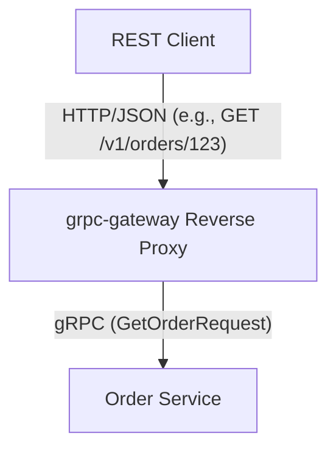
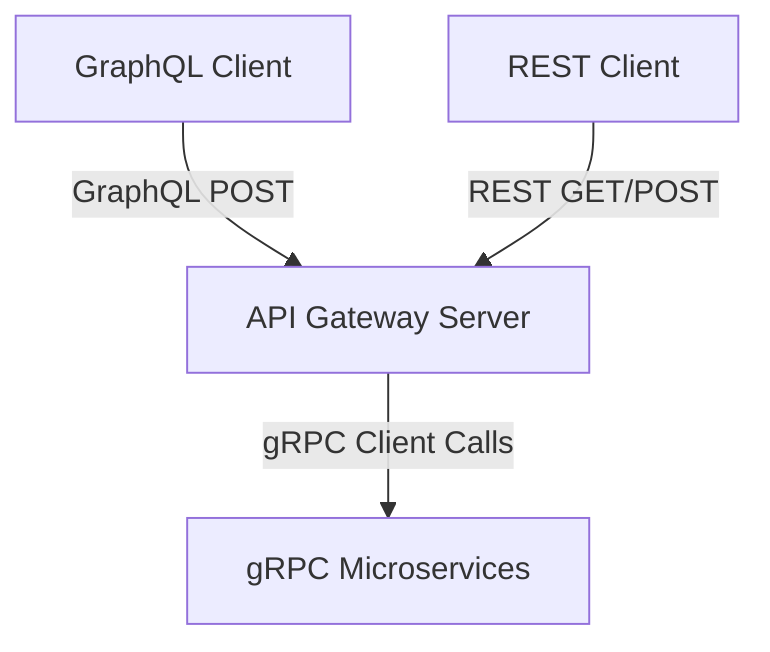

# Handling REST Clients with a gRPC Backend

If your internal microservices communicate via gRPC, but you also need to support **REST clients** (e.g., webhooks, public-facing APIs, legacy integrations, or clients that do not support GraphQL), there are two industry-standard ways to handle this in Go.

---

## 1. Option A: `grpc-gateway` (Recommended for standard REST APIs)

[grpc-gateway](https://github.com/grpc-ecosystem/grpc-gateway) is a Google-designed `protoc` plugin that generates a reverse-proxy server. This proxy reads your `.proto` files, compiles them, and translates RESTful JSON requests into gRPC calls automatically.



### How it works
1. **Annotate your Proto files**: You define the HTTP paths and methods directly inside your `.proto` definition.
2. **Code Generation**: Running `protoc` generates a Go reverse proxy file alongside the gRPC code.
3. **Run the Proxy**: You spin up the generated proxy server. It listens on an HTTP port, translates incoming REST requests to gRPC, forwards them to your services, and translates responses back to JSON.

### Proto Example (`order.proto` with HTTP annotations):
```protobuf
syntax = "proto3";

package ecommerce.order.v1;

option go_package = "github.com/yourusername/ecommercesagapattern/shared/pb/orderv1;orderv1";

import "google/api/annotations.proto"; // Standard Google annotations import

service OrderService {
  rpc GetOrder(GetOrderRequest) returns (GetOrderResponse) {
    // Expose this gRPC service as a REST endpoint
    option (google.api.http) = {
      get: "/v1/orders/{order_id}"
    };
  }
}

message GetOrderRequest {
  string order_id = 1;
}

message GetOrderResponse {
  string order_id = 1;
  int64 total_amount_cents = 2;
}
```

### Pros & Cons
* **Pros**: 
  * **Zero Boilerplate**: The proxy code is generated completely. You write no manual routing, payload parsing, or gRPC mapping code.
  * **Single Source of Truth**: The `.proto` file serves as both the gRPC and REST specification.
  * **OpenAPI Spec Generation**: It can automatically generate `swagger.json` / OpenAPI specs for your REST clients.
* **Cons**:
  * Slightly rigid. The REST paths must match the gRPC method signatures.

---

## 2. Option B: Manual REST Handlers in the API Gateway (Hybrid Gateway)

If you already have a GraphQL Gateway (e.g., in [apigateway](file:///home/rajeev/files/webdev/gprojects/ecommercesagapattern/apigateway)), you can simply mount standard REST routes (using Gin, Echo, or standard Go `net/http`) alongside your GraphQL handler.



### How it works
You use the same gRPC client instances (e.g., `OrderServiceClient`, `CatalogServiceClient`) in both your GraphQL resolvers and your REST handlers.

```go
package main

import (
	"context"
	"net/http"

	"github.com/gin-gonic/gin"
	"github.com/yourusername/ecommercesagapattern/shared/pb/orderv1"
)

type Router struct {
	orderClient orderv1.OrderServiceClient
}

func (r *Router) RegisterRoutes(e *gin.Engine) {
	// REST Route
	e.GET("/v1/orders/:id", r.GetOrderHandler)
}

func (r *Router) GetOrderHandler(c *gin.Context) {
	orderID := c.Param("id")

	// Call the gRPC microservice
	resp, err := r.orderClient.GetOrder(c.Request.Context(), &orderv1.GetOrderRequest{
		OrderId: orderID,
	})
	if err != nil {
		c.JSON(http.StatusInternalServerError, gin.H{"error": err.Error()})
		return
	}

	// Respond with custom JSON
	c.JSON(http.StatusOK, gin.H{
		"id":          resp.OrderId,
		"totalAmount": resp.TotalAmountCents,
	})
}
```

### Pros & Cons
* **Pros**:
  * Highly customizable REST payloads.
  * Easy to bundle GraphQL and REST into a single codebase/service ([apigateway](file:///home/rajeev/files/webdev/gprojects/ecommercesagapattern/apigateway)).
* **Cons**:
  * You must manually write and maintain REST handlers, models, and mapping logic.

---

## 3. Comparison & Decision matrix

| Metric | Option A: `grpc-gateway` (Auto-Generated) | Option B: Manual REST Handlers (Hybrid Gateway) |
|---|---|---|
| **Development Cost** | Very low (fully automated) | High (manual mapping code) |
| **API Customization** | Low (strictly mirrors gRPC types) | High (unlimited payload manipulation) |
| **Maintenance** | Low (recompiles on proto changes) | High (requires updating handlers manually) |
| **Documentation** | Auto-generates Swagger (OpenAPI) | Manual OpenAPI writing |

---

## Recommendation

For our Go microservice project:
1. **Use Option A (`grpc-gateway`)** if your REST clients just need standard CRUD operations and a direct representation of the backend services. It is clean, industry-standard, and generates OpenAPI docs automatically.
2. **Use Option B (Manual handlers inside [apigateway](file:///home/rajeev/files/webdev/gprojects/ecommercesagapattern/apigateway))** if your REST clients require highly customized, consolidated endpoints that differ significantly from your gRPC definitions, or if you prefer having one consolidated API gateway server.
