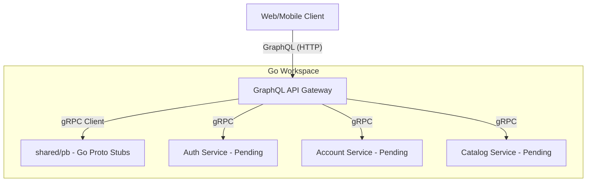

# E-Commerce Microservices - Current Project State & Design Log

Welcome! This document provides a summary of what has been accomplished, key architectural design decisions made, and the layout of the project to help onboarding new developers and guide our next sessions.

---

## 🏛️ Architecture Overview

The system is structured as an **E-Commerce Platform** powered by Go microservices. Clients interact with a single **GraphQL API Gateway (BFF)** which communicates with backend services via high-performance **gRPC**. Distributed transactions (e.g., placing an order) are orchestrated using the **Saga Pattern**.



---

## 📁 Repository Structure

We use a **Monorepo** managed with **Go Workspaces**. This allows each service to remain a decoupled Go module with its own dependency tree while importing local packages easily.

```text
ecommercesagapattern/
├── go.work                   # Go Workspace definition
├── Makefile                  # Build automation for compilation
├── apigateway/               # GraphQL Gateway (gqlgen + chi)
│   ├── go.mod                # Gateway dependencies
│   ├── gqlgen.yml            # gqlgen generator config
│   ├── server.go             # Gateway HTTP server entrypoint
│   └── graph/
│       ├── schema.graphqls   # Clean client-focused GraphQL Schema
│       ├── resolver.go       # Dependency Injection (gRPC clients)
│       └── schema.resolvers.go # Query/Mutation Resolver functions
└── shared/                   # Shared module for gRPC stubs & utilities
    ├── go.mod
    ├── protofiles/           # Raw .proto files (versioned under /v1/)
    └── pb/                   # Compiled Go Protobuf files (*.pb.go)
```

---

## 💎 Design Choices & Rationale

### 1. Go Workspaces (`go.work`)
* **Decision**: Group independent microservice modules into a single workspace using `go.work`.
* **Rationale**: Avoids the need to publish shared libraries (like protobuf stubs) to GitHub before importing them. It also prevents clunky `replace` directives inside each service's `go.mod` file, making local development clean and portable.

### 2. Versioned Protobuf Files (`v1/`)
* **Decision**: Group all Proto definitions in versioned directories (e.g., `shared/protofiles/auth/v1/auth.proto`).
* **Rationale**: Follows industry-standard gRPC design practices. It prevents breaking API changes for client services as the system evolves and avoids import/namespace collisions during compilation.

### 3. Schema-First GraphQL Gateway (`gqlgen`)
* **Decision**: Build the Gateway using `gqlgen` based on a decoupled GraphQL schema instead of auto-generating GraphQL types from proto files.
* **Rationale**: 
  - **Decoupling**: Prevents internal database/proto changes from immediately breaking frontends.
  - **Aggregation**: Allows resolvers to call multiple backend services (e.g., fetching an Order, then stitching User Profile and Product details) in parallel to return one clean nested JSON response.

### 4. Monetary Values in Cents (`Int`)
* **Decision**: Represent all monetary prices as integer cents (e.g., `priceCents: Int!`) instead of `Float`.
* **Rationale**: Floats introduce rounding and binary approximation errors (e.g., `0.1 + 0.2 != 0.3`). Storing and transmitting prices as integers completely eliminates financial rounding bugs.

### 5. Cursor-based Pagination (`Connection` Pattern)
* **Decision**: Query products using Relay-compliant cursor connections (`products(first: Int, after: String): ProductConnection!`).
* **Rationale**: Superior to traditional offset/limit pagination for e-commerce listings, supporting infinite scrolling UI components and preventing duplicate/skipped items when items are added during active scrolling.

---

## 🏁 Progress to Date
1. **Proto Standardisation**: Removed duplicate root protos and kept only versioned ones.
2. **Workspace Init**: Configured `go.work` linking `apigateway/` and `shared/`.
3. **Stub Generation**: Generated Go gRPC types in `shared/pb/` using `make gen`.
4. **Gateway Scaffolding**: Initialized `gqlgen` and configured the client-facing GraphQL schema in `schema.graphqls`.

---

## 🎯 Next Steps (Session 2 Plan)
We are entering **Phase 2: Authentication & Middleware**.
1. Scaffold the `auth/` microservice module (gRPC server).
2. Wire gRPC connection pooling in the API Gateway.
3. Replace standard HTTP server in `server.go` with **Chi Router**.
4. Implement JWT validation middleware in the Gateway.
