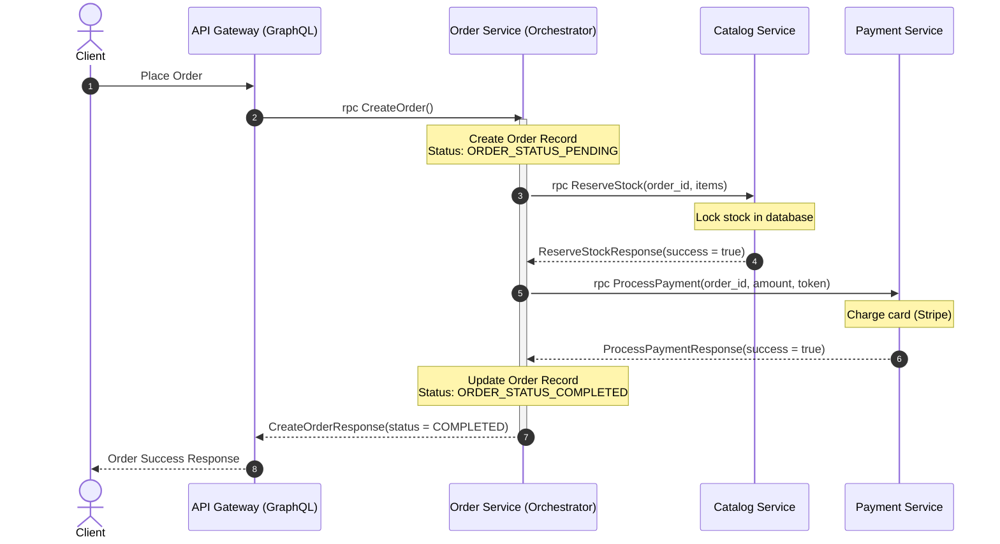
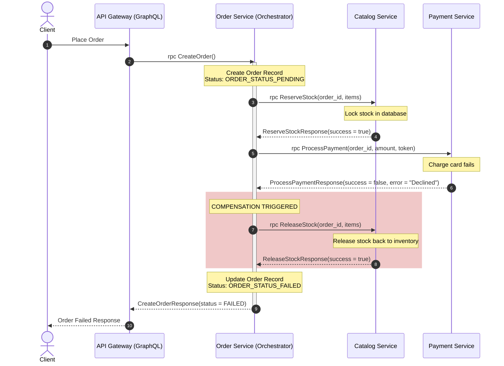

# Project Status & Saga Design Documentation

This document records the work completed during our development session on the **Order Microservice**, the architectural design of the **Saga Pattern** orchestrator, and the blueprint created for the **Catalog Microservice**.

---

## 📅 Session Accomplishments

### 1. Order Microservice Refactoring & Implementation
We have fully implemented the core layers of the **Order Microservice** using Hexagonal Architecture and verified that it compiles successfully.
* **Domain Model Alignment:** Refactored [`orderdetail.go`](file:///home/rajeev/files/webdev/gprojects/ecommercesagapattern/order/internals/domain/orderdetail.go) to utilize UUIDs (`string`) for orders, users, and products. Represented pricing as integer cents (`int64`) to prevent financial floating-point rounding errors.
* **Repository Adapter:** Implemented a transaction-safe repository in [`Repo.go`](file:///home/rajeev/files/webdev/gprojects/ecommercesagapattern/order/internals/repo/Repo.go) that writes to both `orders` and `order_items` tables using PostgreSQL transactions.
* **Business Service & Saga Orchestrator:** Implemented the core business logic in [`ordersrv.go`](file:///home/rajeev/files/webdev/gprojects/ecommercesagapattern/order/internals/service/ordersrv.go). The service hosts the Saga Orchestration flow that coordinates inventory locks and charges with external microservices.
* **gRPC Transport Adapter:** Implemented [`grpc.go`](file:///home/rajeev/files/webdev/gprojects/ecommercesagapattern/order/internals/grpc/grpc.go), embedding protobuf server stubs and implementing mapping logic between domain entities and protobuf messages.
* **Database Migrations:** Created PostgreSQL up and down migrations ([`up.sql`](file:///home/rajeev/files/webdev/gprojects/ecommercesagapattern/order/migrations/000001_create_orders_and_items_table.up.sql) / [`down.sql`](file:///home/rajeev/files/webdev/gprojects/ecommercesagapattern/order/migrations/000001_create_orders_and_items_table.down.sql)) to construct the `orders` and `order_items` tables.

### 2. Catalog Microservice Design
We drafted the blueprint for the **Catalog Microservice** to prepare for Phase 3:
* Created [`catalog/service.md`](file:///home/rajeev/files/webdev/gprojects/ecommercesagapattern/catalog/service.md) to serve as the development guide.
* Designed the PostgreSQL schema containing the `products` table (holding stock counts) and a `stock_reservations` table (managing Saga locks).
* Outlined how `ReserveStock` and `ReleaseStock` achieve **concurrency safety** (using row-level locking via `SELECT ... FOR UPDATE`) and **idempotency** (using `order_id` lookup checks).

---

## 🔄 The E-Commerce Saga Pattern Design

To ensure data consistency across multiple decentralized database instances (`order_db`, `catalog_db`, and the external Payment service) without resorting to slow and blocking 2-Phase Commit (2PC) protocols, we use an **Orchestrated Saga Pattern**.

The **Order Service** acts as the central **Orchestrator**, commanding the sequence of local transactions and executing compensations when any step fails.

### A. The Success Sequence (Happy Path)
1. **Order Service** writes a local record in `orders` with status `ORDER_STATUS_PENDING`.
2. **Order Service** calls **Catalog Service** `ReserveStock(order_id, items)`. Catalog locks the requested items and returns success.
3. **Order Service** calls **Payment Service** `ProcessPayment(order_id, user_id, amount_cents, token)`. Payment charges the card and returns success.
4. **Order Service** updates local order status to `ORDER_STATUS_COMPLETED`.

### B. The Rollback Sequence (Compensating Path)
If the card is declined during step 3, we must execute a **compensating transaction** to release the items locked in the Catalog service:
1. **Order Service** writes order with status `ORDER_STATUS_PENDING`.
2. **Order Service** calls **Catalog Service** `ReserveStock`. Catalog locks the stock.
3. **Order Service** calls **Payment Service** `ProcessPayment`. Payment returns failure (e.g. Card Declined).
4. **Order Service** initiates compensation by calling **Catalog Service** `ReleaseStock(order_id, items)` to unlock items.
5. **Order Service** updates local order status to `ORDER_STATUS_FAILED`.

---

## 🎯 Next Steps & Backlog

As we move on to the **Catalog Microservice**, the immediate backlog is:
1. **Scaffold Catalog Module:** Copy the Hexagonal directory structure to `catalog/`.
2. **Apply Schema:** Apply [`catalog/service.md`](file:///home/rajeev/files/webdev/gprojects/ecommercesagapattern/catalog/service.md#L49-L82) migrations to database.
3. **Implement Concurrency-Safe Stock Lock:** Implement the `SELECT ... FOR UPDATE` query logic in the Catalog repository.
4. **Wire Clients:** Integrate the Catalog and Payment gRPC clients inside the Order service orchestrator.

